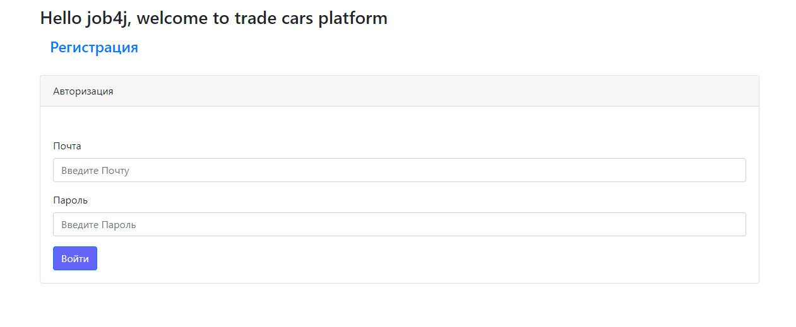
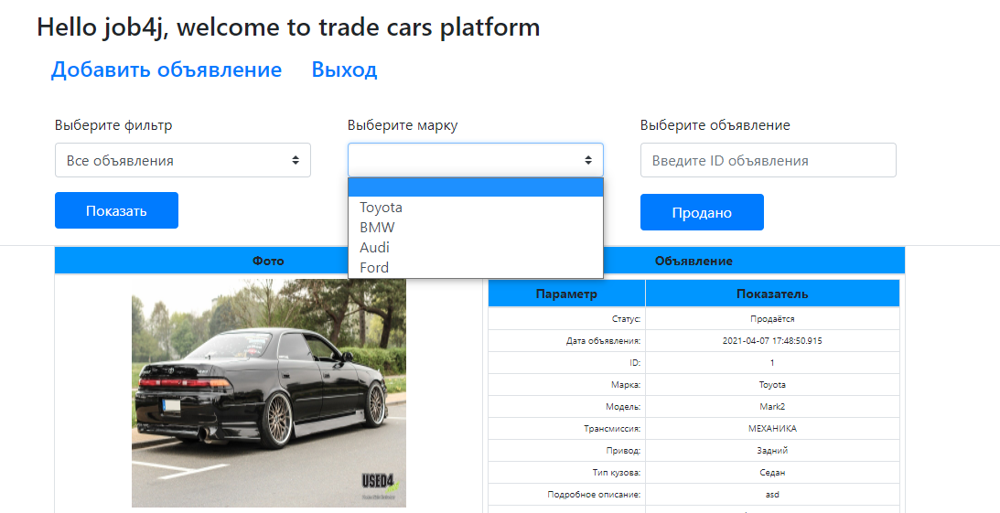

# job4j_cars

Добро пожаловать на площадку с объявлениями о продаже автомобилей.
Данное приложение позволяет ознакомится с объявлениями, устанавливая разные фильтры, 
а также самостоятельно разместить объявление о продаже.

В данном проекте использовались следующие технологии:
- Servlets (работа с сессиями и атрибутами)
- JSP (+JSTL)
- Simple HTML/JS(JQueue|Ajax)/CSS
- Hibernate (HQL) + PostgreSQL
- Apache Tomcat (локальный запуск)
- OOP
- MVC Pattern
- Mockito/JUnit4
- slf4j/log4j
- Travis CI / CodeCov / CheckStyle

Функциональность приложения предусматривает:

- Аутентификацию и регистрацию мользователей (валидацию наличия заполненных полей)

  
- Общий список объявлений

    
- Различные фильтры (Все/Не проданные/Свои объявления/С фото/За последний день)

- Отдельный фильтр по маркам автомобилей (+валидация)

  

- Возможность отметить машину как проданную (с учётом валидации автора объявления) указав ID объявления (доступное в общей информации)
  
  
  

    
- Возможность разместить своё объявление (с возможностью загрузить фото на сервер и валидацией заполнения полей)

